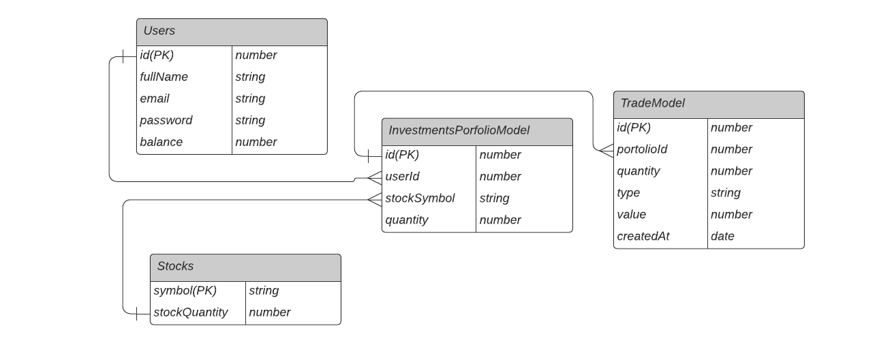

<h1 align="center">
  Investments App
   
</h1>

<b>Welcome to the Investments App Repository!</b> This project is a REST API for an investments app, with endpoints to create and manage your user account, login, deposit money into your account, withdraw, buy and sell assets, and check your transaction history and earnings so far. All the development was with TypeScript and Node.js, using as well libraries such as Express and SequelizeORM for the database models.

# Installation

The project can be run locally, using the docker-compose command. To run this file: 

1. Clone project repository and get into the folder:
  - `cd investments-app`

2. Install project dependencies:

  - `npm install`

3. Rename .env.example file to .env;

4. Create a free account in FinnHub in this [link](https://finnhub.io/), to receive a token and be able to search for current stock values. This process is easy and only takes 1 minute. After receiving your token,  replace de API_TOKEN value in the .env file with the token you have just received. In case you don`t want to do this process, it is also possible to test the application without Finnhub. In this case, change the variable EXTERNAL_API in the .env file to 'false'; 

5. Run command to build and upload containers. Be sure there are no other services in the 3000 or 5432 ports:</b>

  - `docker-compose up --build -d`

6. The application will be running on port 3000!

7. For unit tests, run the following commands to test the application and to check test coverage: 

  - `docker exec -it stock-app npm test`
  - `docker exec -it stock-app npm run test:coverage`

# Deploy and full documentation

The API full documentation was built according to Open API specs, and it is available in the deploy <b>[link](https://andrewerk-investments-app.herokuapp.com/docs/)</b> through <b>Swagger</b> User Interface. The requests sent by this interface will be running directly on the cloud database.

This project was deployed using Heroku and Supabase for the DB. It uses a <b>CI/CD pipeline</b>, with every push to this Git Repository being tested by <b>GitHub Actions</b>, which runs the unit tests and the ESlint verification. After the actions are successfully finished, Heroku identifies the new push and starts building again, uploading the new version to the production environment.

The first access to the deployed link can take over 30 seconds, once the application may be in Heroku's "sleep mode".

# Importante information about the project

  
Stock prices in real time
 

The system consumes [Finnhub](https://finnhub.io/), an <b>external API to obtain current stock prices. </b> Thus, as explained in the installation instructions, it's important to have one <b>authentication token from Finnhub </b> to run the application locally and insert it into the environment variable API_TOKEN. Otherwise, you can set the environment variable EXTERNAL_API to false, and a backup small file will be used and only the stocks on this file can be used to test the application, with old data. The file can be found at /utils/mainStocks.

  
About asset quantity for purchase
 

The asset quantity in the system is <b>randomly generated</b> only one time, at the moment this specific stock is used by the app for the very first time. The next time this same stock is used by the application, the <b>random value will not be replaced.</b>

  
Application Architecture
 

This REST API was developed using <b>MSC - Model, Service, and Controller architecture</b>.  The Model layer is responsible to manage the database with Sequelize, and in this project, it uses Postgres as DB. The Service layer will request information from the Model layer and to external APIs, as well as validate business rules. 

The project also uses middleware layers to validate and authenticate the requests, as well as manage exceptions.

  
JWT Token and password hashing
 

This project uses JWT Token to authenticate all the requests except login and create a user. The token can be received by creating a user or login into the system and should be sent as the request header "authorization". 

Besides, this project also uses a library to hash passwords before inserting them into the database. The library is bcrypt and is used in the UserModel to generate the hash password and in the login service to verify the password.

  
Database
 

The Database used for this application can be represented through this ERD.

  
Technologies applied
 

- TypeScript;
- Express;
- Node.js;
- Sequelize and sequelize-typescript;
- Postgres;
- Docker and docker-compose;
- Joi;
- bcrypt;
- JWT Token;
- Mocha, Chai, Sinon, Supertest for unit testing;
- nyc for test coverage.

